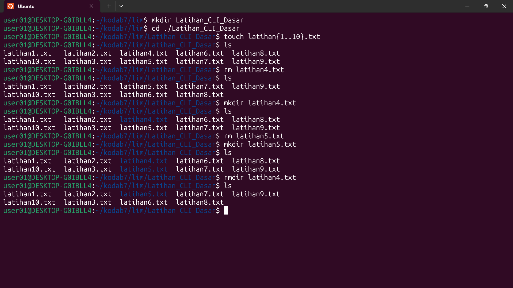

# CLI DASAR

## 1. Membuat folder "Latihan_CLI_Dasar"
### Command : mkdir Latihan_CLI_Dasar

 ## 2. Membuat file kosong "latihanX.txt" didalamnya sebanyak 5 (X diganti 1-5)
### Command : touch latihan{1..5}

## 3. Melihat daftar file yang sudah di buat
### Command : ls

## 4. Menghapus file dengan urutan ke 4 
### Command : rm latihan4.txt

 ## 5. Membuat folder dengan nama "latihan4.txt"
### Command : mkdir latihan4.txt

## 6. Menghapus file dengan urutan ke 5 
### Command : rm latihan5.txt

## 7. Membuat folder dengan nama "latihan5.txt"
### Command : mkdir latihan5.txt

## 8. Melihat daftar file dan folder yang sudah di buat
### Command : ls

## Menghapus folder dengan nama "latihan4.txt"
### Command : rmdir latihan4.txt

